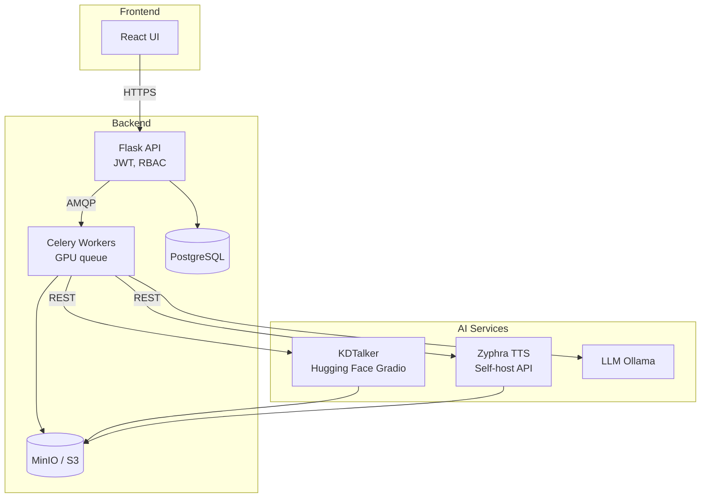

# Voice-Cloned Talking-Head Lecturer

> 🎓 An AI-powered platform that transforms static portraits and voice samples into dynamic lecture videos with synchronized lip movements and natural speech.

## 🌟 Overview.

This application enables medical faculty and educators to create personalized lecture videos by simply uploading:
- **📸 A portrait photo** - Any clear headshot image
- **🎤 A voice sample** - 10-30 seconds of reference audio
- **📝 Lecture content** - Script text or prompts for AI generation

The system then generates a realistic talking-head video where the digital avatar speaks the provided content with the cloned voice and synchronized lip movements.

## 🏗️ Architecture

### Tech Stack
- **Frontend**: React + Tailwind CSS + Vite
- **Backend**: Flask + Celery + Redis
- **Database**: PostgreSQL
- **Storage**: MinIO (S3-compatible)
- **AI Models**:
  - **Zyphra TTS** (Apache 2.0) - Voice cloning & speech synthesis
  - **KDTalker** (CC BY-NC 4.0) - Portrait-to-video animation
  - **Llama-3-8B** (via Ollama) - Script generation

### System Architecture


## 🚀 Quick Start

### Prerequisites
- Docker & Docker Compose
- NVIDIA GPU (for video generation)
- Node.js 18+ (for frontend development)
- Python 3.9+ (for backend development)

### 1. Clone & Setup
```bash
git clone <repository-url>
cd digitalclone-iitg/app_v3
cp .env.example .env
# Edit .env with your API keys and configuration
```

### 2. Development Environment
```bash
# Start supporting services
docker-compose up -d

# Initialize database
python scripts/init_db.py init

# Start development server
python scripts/run_dev.py
```

### 3. Test Authentication System
```bash
# Run authentication tests
python scripts/test_auth.py

# Or test manually with curl
curl -X POST http://localhost:5000/api/auth/register \
  -H "Content-Type: application/json" \
  -d '{
    "email": "test@example.com",
    "username": "testuser",
    "password": "TestPass123",
    "confirm_password": "TestPass123",
    "first_name": "Test",
    "last_name": "User"
  }'
```

### 4. Access the Application
- **Backend API**: http://localhost:5000
- **Health Check**: http://localhost:5000/health
- **MinIO Console**: http://localhost:9001
- **Redis Commander**: http://localhost:8081

## 🔐 Authentication System (✅ COMPLETED)

The authentication system is fully implemented with the following features:

### Endpoints
- `POST /api/auth/register` - User registration with validation
- `POST /api/auth/login` - User login with JWT tokens  
- `POST /api/auth/refresh` - Refresh access tokens
- `POST /api/auth/logout` - Secure logout with token blacklist
- `GET /api/auth/profile` - Get user profile
- `PUT /api/auth/profile` - Update user profile
- `POST /api/auth/change-password` - Change password with validation
- `POST /api/auth/verify-token` - Verify token validity

### Security Features
- **JWT Authentication** with access & refresh tokens
- **Token Blacklisting** using Redis for secure logout
- **Password Hashing** using bcrypt with configurable rounds
- **Input Validation** using Marshmallow schemas
- **Role-Based Access Control** (Admin, Faculty, Student)
- **Password Strength Requirements** (uppercase, lowercase, digit)
- **Email Uniqueness** validation
- **Account Status** checking (active/inactive)

### Default Admin Account
After running `python scripts/init_db.py init`:
- **Email**: admin@voiceclone.edu
- **Password**: AdminPass123
- **Role**: Admin
- ⚠️ **Change password after first login!**

## 📖 Documentation

- **[📁 Folder Structure](FOLDER_STRUCTURE.md)** - Complete project organization
- **[🏗️ Architecture](docs/arch.md)** - System design and components
- **[⚡ Workflow](docs/voice_clone_workflow.md)** - Generation process details
- **[🔧 Development](docs/development.md)** - Setup and development guide
- **[🚀 Deployment](docs/deployment.md)** - Production deployment
- **[📋 API Reference](docs/api.md)** - REST API documentation

## 🎯 Features

### ✅ Core Features
- **Multi-user authentication** with JWT and RBAC
- **Asset management** for portraits and voice samples
- **Script generation** using LLM or manual input
- **Voice cloning** with high-quality TTS synthesis
- **Talking-head video generation** with lip-sync
- **Real-time job monitoring** with WebSocket updates
- **SCORM export** for LMS integration

### 🔄 Generation Workflow
1. **Upload Assets** → Portrait image + voice reference
2. **Create Script** → Manual input or AI generation
3. **Generate Voice** → Zyphra TTS with speaker cloning
4. **Create Video** → KDTalker animation with audio sync
5. **Export & Share** → Download MP4 or SCORM package

## 🛠️ Development

### Backend Development
```bash
cd backend
pip install -r requirements.txt
flask db upgrade
flask run --debug
```

### Frontend Development
```bash
cd frontend
npm install
npm run dev
```

### Running Tests
```bash
# Backend tests
cd backend && pytest

# Frontend tests
cd frontend && npm test
```

## 📦 Deployment

### Docker Production
```bash
docker-compose -f docker-compose.prod.yml up -d
```

### Kubernetes
```bash
kubectl apply -f infra/kubernetes/
```

## 🔒 Security & Compliance

- **Data Encryption**: All files encrypted at rest
- **Access Control**: JWT-based authentication with RBAC
- **Privacy**: Auto-deletion of reference audio (configurable)
- **Licensing**: 
  - Zyphra TTS (Apache 2.0) - Commercial use permitted
  - KDTalker (CC BY-NC 4.0) - Educational use, commercial licensing available

## 🤝 Contributing

1. Fork the repository
2. Create a feature branch (`git checkout -b feature/amazing-feature`)
3. Commit your changes (`git commit -m 'Add amazing feature'`)
4. Push to the branch (`git push origin feature/amazing-feature`)
5. Open a Pull Request

## 📄 License

This project is licensed under the MIT License - see the [LICENSE](LICENSE) file for details.

**Note**: Some AI models have specific licensing requirements:
- KDTalker: CC BY-NC 4.0 (non-commercial use)
- Commercial licensing available separately for production use

## 🆘 Support

- **Issues**: [GitHub Issues](../../issues)
- **Documentation**: [docs/](docs/)
- **Discussions**: [GitHub Discussions](../../discussions)

---

**Made with ❤️ for educators and researchers**
