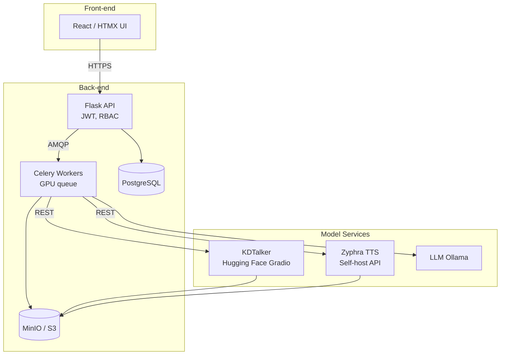

# High-level Architecture

```mermaid
graph TD
    subgraph Front-end
        A[React / HTMX UI]
    end
    subgraph Back-end
        B[Flask API<br/>JWT, RBAC]
        C[Celery Workers<br/>GPU queue]
        D[(PostgreSQL)]
        E[(MinIO / S3)]
    end
    subgraph Model Services
        F[KDTalker<br/>Hugging Face Gradio]
        G[Zyphra TTS<br/>Self-host API]
        H[LLM Ollama]
    end
    A -->|HTTPS| B
    B -->|AMQP| C
    B --> D
    C -->|REST| F
    C -->|REST| G
    C --> H
    C --> E
    F --> E
    G --> E
```
