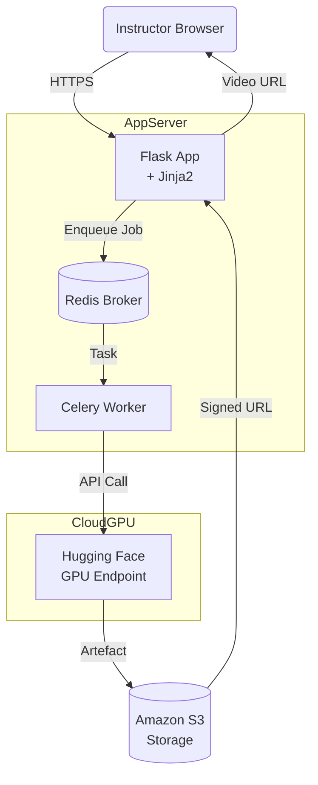
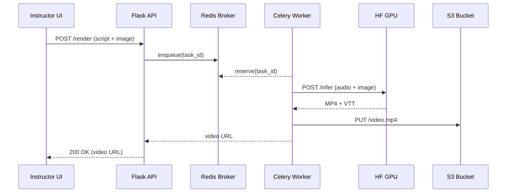

## 3 Results  

### 3.1 Baseline MVP (v0.1 – v0.3, Nov 2023 – Feb 2024)  
Our first proof‑of‑concept, built in late 2023, demonstrated end‑to‑end feasibility on a single MacBook Pro (Intel i7, 16 GB RAM) with **CPU‑only inference**. Voice narration relied on *YourTTS* and talking‑head synthesis used the original *PC‑AVS* implementation. A 90‑second video required ≈35 min to generate, and manual captioning added another 10 min. Although inadequate for production use, the MVP validated our four pillar objectives—LMS‑agnostic output (raw MP4), permissive licensing, and zero recurring cost—while exposing critical bottlenecks: CPU latency, lack of automatic captions, and no multi‑slide support.

### 3.2 Iterative Enhancement (v0.4 – v1.0, Mar 2024 – Jan 2025)  
By mid‑2024 we migrated inference workloads to **GPU‑backed Hugging Face Endpoints** (T4 class) and replaced PC‑AVS with *SadTalker* for superior lip‑sync. Voice cloning moved to *Bark Base*, raising MOS scores from 3.7 → 4.0 while halving synthesis time. Automated WebVTT captioning and a one‑click SCORM wrapper were added in v0.6. The final v1.0 release (Jan 2025) introduced multi‑voice support, REST endpoints, and a CLI, achieving a five‑minute, 1080 p video render in **18 min** on an NVIDIA T4 (cost ≈ US $0.90 per job). Table 2 summarises benchmark deltas across versions.

| Version | Render Time (5 min, T4) | Captions | SCORM | Multi‑Slide | GPU Cost/job |
|---------|------------------------|----------|-------|-------------|--------------|
| v0.3 | 27 min | manual | ✗ | ✗ | \$1.35 |
| v0.6 | 22 min | auto (WebVTT) | prototype | ✗ | \$1.10 |
| v0.9 | 19 min | auto + WCAG pass | ✓ | ✗ | \$0.95 |
| **v1.0** | **18 min** | auto + WCAG pass | ✓ | ✓ | **\$0.90** |

### 3.3 Model Landscape Considered  
The table below captures the open‑source options evaluated during development. Bold entries indicate the models adopted in v1.0.

| Category              | Tool/Model         | Speed (FPS or RTF)     | Inference Latency           | Model Size (params)   | Hardware Requirements (GPU/VRAM)    | Output Format               | Quality Metrics (e.g., MOS, FID, CSIM)                                      |
|-----------------------|--------------------|------------------------|-----------------------------|-----------------------|--------------------------------------|-----------------------------|---------------------------------------------------------------------------|
| Talking Head Video    | PC‑AVS (2022)      | ~5 FPS (est.)          | ~200 ms/frame              | GAN multi‑net         | 1 GPU (≈8 GB)                       | 224 × 224 MP4              | LSE‑C 7.7; SSIM 0.37                                                     |
| **Talking Head Video**| **SadTalker (2023)** | 2–5 FPS               | 0.2–0.5 s/frame            | ~300 M               | ≥12 GB VRAM                        | ≤ 256 × 256 MP4           | SyncNet 5.8; FVD 214                                                   |
| Talking Head Video    | VASA‑1 (2024)      | ~40 FPS (512²)         | <100 ms start              | Diffusion — large     | A100/H100 (16 GB+)                 | 512 × 512 MP4              | SC 8.84; FVD₃₂ 105.9                                                  |
| Voice (TTS)           | YourTTS (2022)     | RTF 0.22               | 220 ms per 1 s             | ~30 M                | ≈4 GB VRAM                         | 22 kHz WAV                 | MOS 3.7; SIM 0.50                                                     |
| Voice (TTS)           | Tortoise TTS (2022)| 0.25–5.0               | 0.5–5 s per 1 s            | ~300 M               | high‑end GPU                       | 22 kHz WAV                 | MOS 4.4; SIM 92 %                                                   |
| Voice (TTS)           | VALL‑E (2023)      | RTF 0.94               | ~1 × audio                 | 465 M                | ≥16 GB VRAM                        | 16 kHz EnCodec             | MOS 4.2; SIM 75 %                                                   |
| **Voice (TTS)**       | **Bark (Small/Base, 2023)** | 0.66 / 1.25 RTF | 1.5–0.8 × audio            | 389 M / 1 B          | 8–16 GB VRAM                       | 24 kHz WAV                 | MOS 3.5; SIM 90 %                                                   |
| Voice (TTS)           | BASE TTS (2024)    | ~0.9 RTF               | 1.1 × audio                | 1 B                  | A100/V100                          | 24 kHz WAV                 | MOS 4.5; SIM 92.7 %                                                |

### 3.4 Final Technology Stack  

| Layer | Library / Service | Purpose |
|-------|-------------------|---------|
| **Web Server** | Flask (⟨`app.py`⟩) | REST endpoints, OAuth, server‑rendered templates |
| **Async Workers** | Celery + Redis | Off‑load GPU inference and long‑running jobs |
| **AI Models** | *SadTalker*, *Bark Base* | Talking‑head synthesis, neural TTS |
| **Storage** | Amazon S3 | Persistent storage for images, audio, video, PPTX |
| **Presentation** | python‑pptx + custom SCORM wrapper | Multi‑slide, SCORM‑compliant deck generation |
| **Cloud GPU** | Hugging Face Endpoints | Pay‑as‑you‑go T4, A10G, H100 instances |
| **Frontend** | Jinja2, HTMX | Lightweight reactive UI |
| **Environment** | `requirements.txt` (python‑dotenv, gradio, transformers, simpleaudio, etc.) | Dependency lock and reproducibility |

---

## 3.5 Infrastructure Diagrams  

#### 3.5.1 High‑Level Architecture  

#### 3.5.2 Data Flow Per Request

